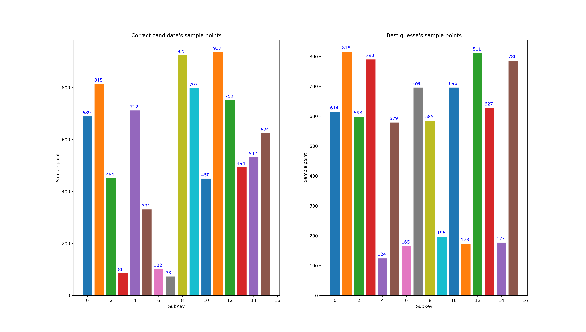
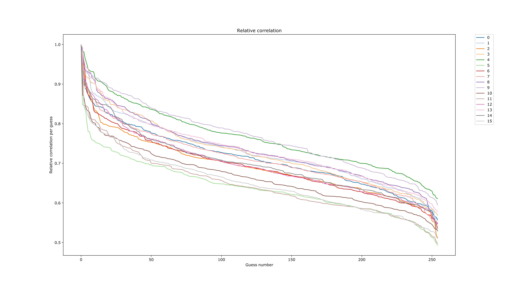

# Use Jlsca to analyse traces from the ChipWhisperer platform

## What is is?
This is a piece of software initially made during Prestegaard's master thesis the spring of 2018. This software serves as a front end which enables the attacker/researcher to use the Jlsca (a software suite made in Julia which is by far more efficient in analysing traces than the ChipWhisperer software) to analyse power traces captured with the ChipWisperer platform where the target device is encrypting using AES-128. 

For info about Jlsca look here - https://github.com/Riscure/Jlsca.

## Features

The software suite has an automation feature where it can attack using different subsets of the captured traces before a brute-force attack is applied if the full AES key is not recovered. 

* Smart brute-force search equivalent calculation for correct key when full AES-128 key is not recovered.
* Automated test setup where different subsets of the trace set are used.
* Output plots showing at what sample point the best guess is at, and what the correct sample point is.
* Output plots showing how the relative correlation for each key candidate.
* Allowing the user to specify different backend attacks

Output plot from test using the PSoC6 with MBEDTLS AES-128 encryption.

Output plot from test using the PSoC6 with MBEDTLS AES-128 encryption.

## Getting Started

### Prerequisites
* ChipWhisperer power traces of AES-128 encryption
* Computer with Windows 7 or 10 (will most likely run fine on Linux using debian/ubuntu)
* Julia (tested with Julia version 1.0.0) https://github.com/JuliaLang/julia
* Jlsca (tested with version [dcc1f4ae] Jlsca v0.1.5 #master) https://github.com/Riscure/Jlsca
* Python 3 (tested with version 3.7.0)

### Updating Jlsca to support this framework
Note:
In order to get all 256 candidates for each subKey instead of default only the top 5 candidates,
`jlsca/src/sca-scoring.jl` must be updated from 

`function printScores(params::DpaAttack, phase::Int, rankData::RankData, targets::Vector{Int}, printsubs=false,  m=5, io=STDOUT) `

to 

`function printScores(params::DpaAttack, phase::Int, rankData::RankData, targets::Vector{Int}, printsubs=false,  m=256, io=STDOUT)` 

## Setup
Inside your project you need a LocalSetup.py file which contains information about your test cases. 
Here the user must specify which tests to run, and with which parameters. 
If this project reaches a stable version, the API should be fixed and properly documented. 
For now, see `Framework/LocalSetupTemplate.py` for inspiration. 

## Running analysis
Explanation of how to run the automated tests framework.
1) Call command  `automate_attack.py --localsetup <path/to/your/local/setup>` 
2) Add `--verbose` for extra logging to terminal. Verbose logging is always included in the log files.  

## Architecture
This project serves as a front end for Jlsca in order to provide easy and flexible input and output for the user.
This framework allows the user to specify different test cases for a given trace set, including using only subsets of the available traces. Everything is handled by the automated attack, but below are different parts of the system described. 

### Convert trace set from ChipWhisperer to Jlsca
The `cw_to_trs.jl` generates a trace set from a ChipWhisperer project to Jlsca project.
The number of traces used is specified when the script is executed. 

### Actual attack on trace set
The `inc_cpa.jl`is the actual attack back end. 
The attack used is the built in incremental cpa from Jlsca.
This attack is highly efficient and precise.
The attack outputs its results in form a log. 

### Smart brute force search
The `JlscaBruteForceCalculation.py` contains the brute force search equivalent calculation. The search algorithm used is based upon trying the next best guess of correct keys. The log from the attack is parsed, then lists of candidates for each sybByte of the key is created sorted by their probability to be the correct subKey guess. Each new full key guess uses the globally next best key candidate. The next best key always swaps in the next unused key candidate with the highest relative correlation. For each subkey, the best guess holds relative correlation 1. The number of needed guesses is calculated based on how many swaps are needed in order to have found the correct key. 

### Results
The `JlscaBruteForceCalculation.py` also generates plots displaying the found results. 
This is made for simplicity to not have to look into logs for the different attacks manually.
A todo could be to add scripts to plot absolute correlation and number of guesses needed when using different amounts traces. Also when using different tuning parameters. 
