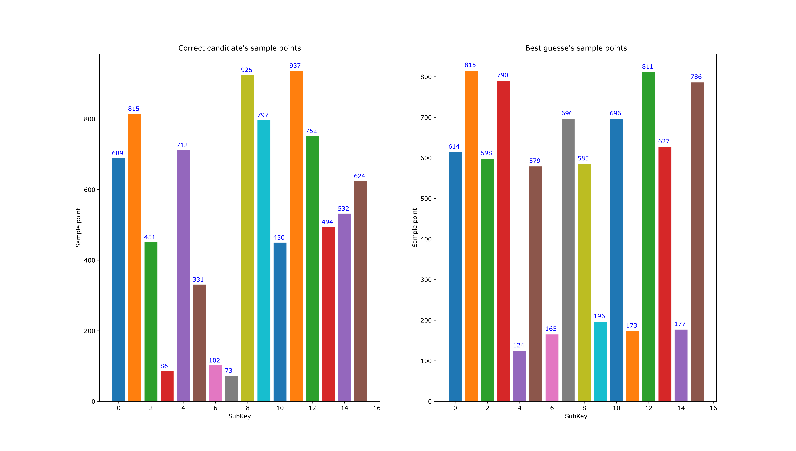

# Use Jlsca to analyse traces from the ChipWhisperer platform

## What is is?
This is a piece of software which is assembled during Prestegaard's master thesis the spring of 2018. This software enables the attacker/researcher to use the Jlsca (a software suite made in Julia which is by far more efficient in analysising traces than the ChipWhisperer software) to analyse power traces captured with the ChipWisperer platform where the target device is encrypting using AES-128. 

For info about Jlsca look here - https://github.com/ikizhvatov/Jlsca

## Features

The software suite has an automation feature where it can attack using different subsets of the capured traces before a brute-force attack is applied if the full AES key is not recovered. 

* Smart brute-force search calculation for correct key when full AES-128 key is not recovered.
* Automated test setup where different subsets of the trace set is used.
* Output plots showing at what sample point the best guess is at, and what the correct sample point is.
* Output plots showing how the relative correlation for each key candidate

Output plot from test using the PSoC6 with MBEDTLS AES-128 encryption.


Output plot from test using the PSoC6 with MBEDTLS AES-128 encryption.


## Getting Started

### Prerequisites
* ChipWhisperer power traces of AES-128 encryption
* The following software: Julia and Jlsca 


### Installing
Do the following:
Go to https://github.com/JuliaLang/julia and https://github.com/ikizhvatov/Jlsca to have the newest versions available. 
Note:

`jlsca/src/sca-scoring.jl` must be updated from 

`function printScores(params::DpaAttack, phase::Int, rankData::RankData, targets::Vector{Int}, printsubs=false,  m=5, io=STDOUT) `

to 

`function printScores(params::DpaAttack, phase::Int, rankData::RankData, targets::Vector{Int}, printsubs=false,  m=256, io=STDOUT)` 

In order to get all 256 key candidates for each subkey, instead of default 5. 
Or use attached zip file with working copy of Julia v. 0.6.2 and 

## Running analysis
Explination of how to run automated tests.
In `automate_attack.bat` three scripts are called after initial setup. 

### Initial setupc
Initial setup in `automate_attack.bat`:
```
set JULIA_NUM_THREADS=8
```
This enables Julia to use all 4 cores + hyper threading on an Intel I7 CPU. 

```
set base_folder=C:\Users\hapr\GIT\Masteroppgave
set target=stm32f7
set aes_mode=baseline_2625mhz
set measurement=1v2
set num_traces_total=64000_data
set date_string=2018.06.15-15.50.08
```
Here project setting such as root folder, target MCU, AES mode, number of traces in data set, etc. is set. 
These parameters needs to be set before each analysis.

```
set FFT_ONLY=1
```
When FFT_ONLY is set only attacks which pre-align the traces using FFT are executed. Attacks without aligning the traces are skipped.  


```
set traces_to_test=64000
```
This sets how many of the traces in the trace set should be used. 
The script by default divides the number of traces used before each attack. 

### Convert trace set from ChipWhisperer to Jlsca
The `cw_to_jlsca.jl` generates a trace set from a ChipWhisperer project to Jlsca project.
The number of traces used is specified when the script is executed. 

### Actual attack on trace set
The `inc_cpa.jl` ant the `inc_cpa_with_fft.jl` are the actual attacks.
The attack used is the built in incremental cpa from Jlsca.
This attack is highly efficient and precise.
The attack outputs its results in form a log. This log if then used in brute force searhing for the correct key.

In order to get all 256 candidates for each subKey instead of default only the top 5 candidates, update the `jlsca/src/scoring.jl` to 

### Smart brute force search
The `parse_logs.py` contains the brute force search. If the correct key is not found during the attack, smart brute force searching for the correct key is used until a certain limit of number of guesses is reached. The search algorihm used is based upon trying the next best guess of correct keys. The log from the attack is parsed, then lists of candidates for each sybByte of the key is created sorted by their propability to be the correct subKey guess. Each new full key guess uses the globally next best key candidate. The search either succeed or reach a certain limit forcing the search to stop.

### Results table
The `create_results_file.py` is a script made for simplicity. The script collects the number of guesses needed in order to find the correct key for all attacks in the automated test setup and stores the numbers in a results file. This is to not have to look into logs for the different attacks manually.

